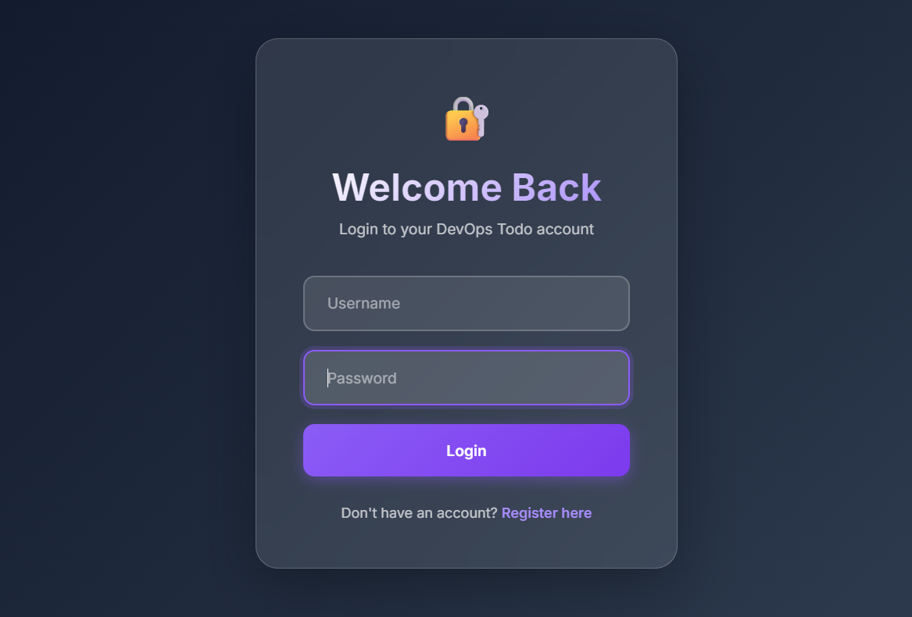
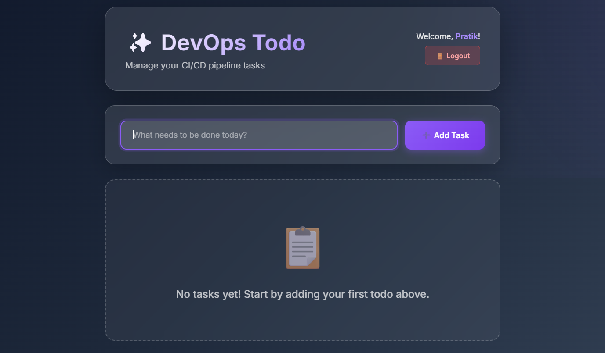

# DevOps Todo App

A simple Todo Application built for practicing DevOps concepts.
This project demonstrates how a basic application can be containerized, deployed, and automated using DevOps tools.

The goal of this project is not just build an app, but learning real DevOps workflow like containerization, CI/CD, and deployment.

## Project Overview

This project includes:

- Simple Todo Application
- Docker containerization
- CI/CD automation
- Infrastructure and deployment practice

It is mainly used for learning and practicing DevOps pipelines and deployment workflows.

## Features

- Create Todo tasks
- View existing tasks
- Mark tasks as completed
- Delete tasks
- Simple UI for task management

## Tech Stack

Application
- Python
- Flask

 DevOps Tools
- Docker
- Git
- GitHub
- GitHub Actions (CI/CD)

 Infrastructure
- Linux
- Render (Cloud Deployment)

## Project Structure
    
## Getting Started

    1) Clone the Repository
        git clone https://github.com/pratikkamble14/devops-todo-app.git
        cd devops-todo-app 
    2 ) Install Dependencies
        pip install -r requirements.txt
    3) Run the Application
        python app.py

Open in browser:

    http://localhost:5000
## Running with Docker

Build the image

    docker build -t devops-todo-app .

Run container

    docker run -p 5000:5000 devops-todo-app

## Deployment

This application is deployed on Render using an automated CI/CD pipeline.

Whenever code is pushed to the GitHub repository, the deployment process runs automatically using GitHub Actions.

Workflow:

    1.Developer pushes code to GitHub

    2.GitHub Actions CI/CD pipeline triggers

    3.Application build process starts

    4.Render automatically deploys the latest version

This ensures continuous integration and continuous deployment for the application.

## CI/CD Pipeline

The project uses GitHub Actions to automate the deployment process.

Example workflow:

    Developer → GitHub Repository → GitHub Actions CI/CD → Render Deployment

This pipeline helps in:

- Automating application deployment
- Reducing manual deployment steps

- Maintaining consistent production builds

## Live Application

Application is deployed on Render.

    https://devops-todo-app-1.onrender.com

### Appilication 

#### Login / Registered Page

#### Main Home Page 

## DevOps Learning Goals

This project helped practice:

- Git workflow
- Containerization with Docker
- CI/CD automation
- Infrastructure basics
- Application deployment

## Future Improvements

- Add database (PostgreSQL / MySQL)
- Kubernetes deployment
- Monitoring with Prometheus
- Logging system
- Authentication

## Author

Pratik Kamble

    GitHub
    https://github.com/pratikkamble14

## License

This project is open source and available under the MIT License.
