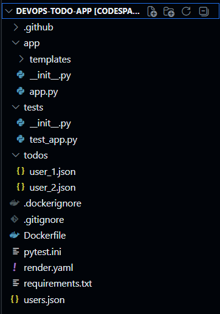

# DevOps Todo App

A simple Todo Application built for practicing DevOps concepts.
This project demonstrates how a basic application can be containerized, deployed, and automated using DevOps tools.

The goal of this project is not just building an app, but learning real DevOps workflow like containerization, CI/CD, and deployment.

## Project Overview

This project includes:

- Simple Todo Application
- Docker containerization
- CI/CD automation
- Infrastructure and deployment practice

It is mainly used for learning and practicing DevOps pipelines and deployment workflows.

## Features

- Create Todo tasks
- View existing tasks
- Mark tasks as completed
- Delete tasks
- Simple UI for task management

## Tech Stack

Frontend / Backend
- Python
- Flask / Django (change according to your project)

DevOps Tools

- Docker
- Git
- GitHub
- CI/CD Pipeline

Infrastructure

- Linux
- Cloud deployment (AWS / Render / etc if used)

## Project Structure

Getting Started

    1) Clone the Repository
        git clone https://github.com/pratikkamble14/devops-todo-app.git
        cd devops-todo-app
    2 ) Install Dependencies
        pip install -r requirements.txt
    3) Run the Application
        python app.py

Open in browser:

    http://localhost:5000
## Running with Docker

Build the image

    docker build -t devops-todo-app .

Run container

    docker run -p 5000:5000 devops-todo-app
## DevOps Learning Goals

This project helped practice:

- Git workflow
- Containerization with Docker
- CI/CD automation
- Infrastructure basics
- Application deployment

## Future Improvements

- Add database (PostgreSQL / MySQL)
- Kubernetes deployment
- Monitoring with Prometheus
- Logging system
- Authentication

## Author

Pratik Kamble

    GitHub
    https://github.com/pratikkamble14

License

This project is open source and available under the MIT License.
