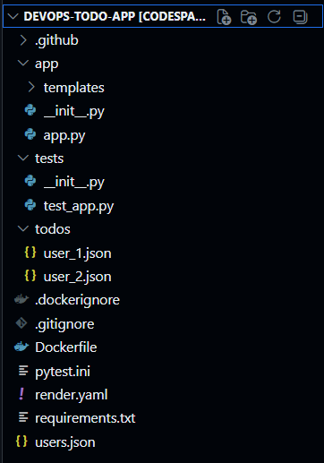
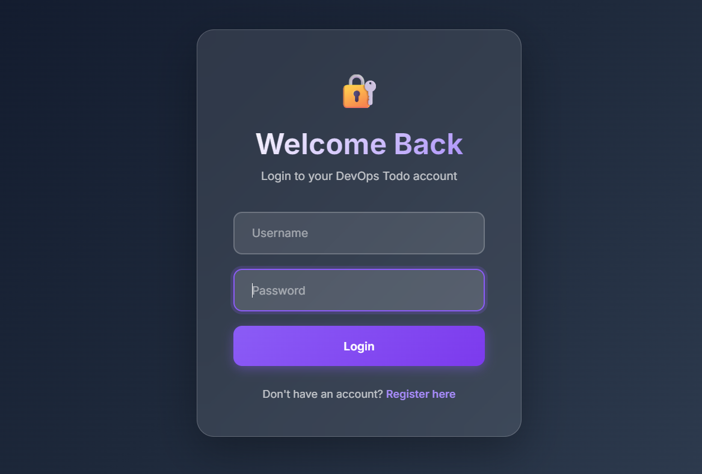
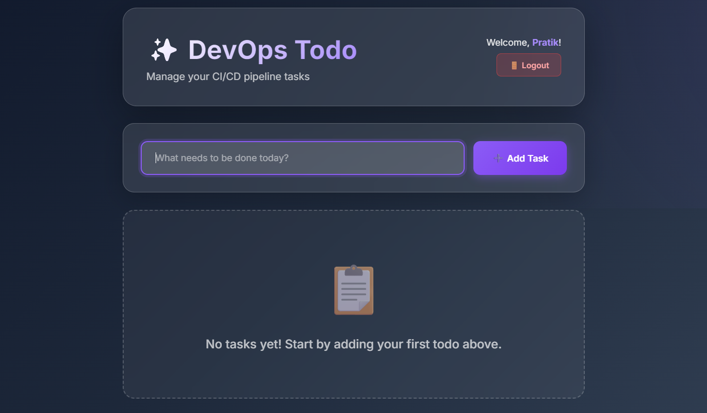

# DevOps Todo App

A simple Todo Application built for practicing DevOps concepts.
This project demonstrates how a basic application can be containerized, deployed, and automated using DevOps tools.
The goal of this project is not just to build an app, but to learn real DevOps workflows like containerization, CI/CD, and cloud deployment.

## Project Overview

This project includes:
- Simple Todo Application
- Docker containerization
- CI/CD automation with GitHub Actions
- Cloud infrastructure on AWS EC2
- Reverse proxy with Nginx

It is mainly used for learning and practicing DevOps pipelines and deployment workflows.

## Features

- Create Todo tasks
- View existing tasks
- Mark tasks as completed
- Delete tasks
- Simple UI for task management

## Tech Stack

### Application
- Python
- Flask

### DevOps Tools
- Docker
- Docker Hub
- Git
- GitHub
- GitHub Actions (CI/CD)

### Infrastructure
- Linux (Ubuntu 24.04)
- AWS EC2
- AWS Elastic IP
- Nginx (Reverse Proxy)

## Project Structure



## Getting Started

### 1. Clone the Repository
```bash
git clone https://github.com/pratikkamble14/devops-todo-app.git
cd devops-todo-app
```

### 2. Install Dependencies
```bash
pip install -r requirements.txt
```

### 3. Run the Application
```bash
python app.py
```

Open in browser:  http://localhost:5000

## Running with Docker

### Build the image
```bash
docker build -t devops-todo-app .
```

### Run container
```bash
docker run -p 5000:5000 devops-todo-app
```

### Pull from Docker Hub
```bash
docker pull pratik140404/devops-todo-app:latest
docker run -p 5000:5000 pratik140404/devops-todo-app:latest
```

## Deployment

This application is deployed on **AWS EC2** using Docker and an automated CI/CD pipeline via GitHub Actions.

Whenever code is pushed to the main branch, the deployment process runs automatically.

### Workflow
1. Developer pushes code to GitHub
2. GitHub Actions CI/CD pipeline triggers
3. Pytest runs automated tests
4. Docker image is built and pushed to Docker Hub
5. EC2 instance pulls latest image from Docker Hub
6. Container restarts with updated application

Developer → GitHub → GitHub Actions → Docker Hub → AWS EC2 → Live App

## CI/CD Pipeline

The project uses GitHub Actions with 3 jobs:

| Job | What it does |
|-----|-------------|
| test | Runs pytest test suite |
| build | Builds Docker image and pushes to Docker Hub |
| deploy | SSHs into EC2 and pulls latest image |

This pipeline helps in:
- Automating application deployment
- Reducing manual deployment steps
- Maintaining consistent production builds
- Zero-downtime deployments

## Infrastructure Setup

| Component | Details |
|-----------|---------|
| Cloud | AWS EC2 |
| Instance | t2.micro (Ubuntu 24.04 LTS) |
| Elastic IP | 13.201.221.29 |
| Reverse Proxy | Nginx (port 80) |
| Container | Docker |
| Image Registry | Docker Hub |

## Live Application

Application is deployed on AWS EC2. 
link : http://13.201.221.29

### Application Screenshots

#### Login / Register Page


#### Main Home Page


## DevOps Learning Goals

This project helped practice:
- Git workflow
- Containerization with Docker
- Docker Hub image registry
- CI/CD automation with GitHub Actions
- AWS EC2 cloud deployment
- Nginx reverse proxy configuration
- Elastic IP management
- Linux server administration

## Future Improvements

- Add database (PostgreSQL / MySQL)
- Kubernetes deployment
- Monitoring with Prometheus + Grafana
- SSL/HTTPS with Certbot
- Custom domain name
- Terraform (Infrastructure as Code)
- Logging system

## Author

Pratik Kamble
- GitHub: https://github.com/pratikkamble14

## License

This project is open source and available under the MIT License.
